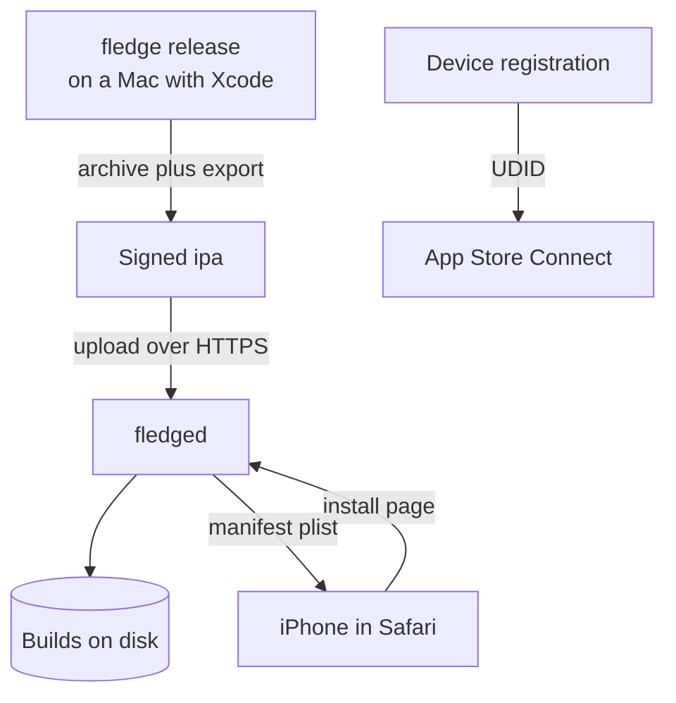

# Fledge

Self-hosted over-the-air distribution for ad hoc iOS builds.

You export a signed `.ipa`, run one command, and open a link on the phone you want it on.
Fledge reads everything it needs out of the archive itself, so there is no metadata to keep in step with the build.

It exists because iOS fails an ad hoc install by saying nothing useful, and almost every cause is knowable in advance.
Fledge tells you before you tap: whether the profile has expired, whether this device is even in it, and whether the build will need Developer Mode turned on.



## Why the build is not on the server

`xcodebuild` and your signing keys live on a Mac.
Fledge splits along that line on purpose: the CLI archives, exports and uploads, and the server only ever receives a finished archive.
No signing certificate, private key, or Apple credential is needed by the server to distribute a build, which is what keeps the thing you expose on your network boring.

## Requirements

- An Apple Developer Program membership. The Enterprise Program is not needed and does not help.
- A Mac with Xcode, for the CLI.
- **HTTPS with a publicly trusted certificate.** iOS refuses an install over plain HTTP and refuses a certificate it cannot validate, in both cases with no diagnostic at all. Fledge will not start unless `FLEDGE_PUBLIC_URL` is `https://`.

## Install

```console
make install          # the CLI, into ~/bin
make build            # both binaries, into bin/
```

The server also ships as a container image and reads everything from the environment.

## Releasing a build

From an app repository:

```console
export FLEDGE_URL=https://fledge.example
export FLEDGE_TOKEN=...

fledge release
```

That archives the scheme, exports it Ad Hoc, and publishes it.
It prints the page to open on the device.

Useful flags:

| Flag | Default | What |
| --- | --- | --- |
| `-scheme` | the only one, or the one named after the project | Which scheme to build |
| `-method` | `release-testing` | Export method. `debugging` for a development build |
| `-team` | Xcode's active team | Apple team ID |
| `-notes` | none | A line shown on the install page |
| `-C` | `.` | Directory holding the workspace or project |
| `-keep` | off | Keep the archive and exported `.ipa` |

If Xcode already produced an archive, skip straight to publishing:

```console
fledge upload -notes "fixes the crash on launch" build.ipa
```

And to see what Fledge reads out of an archive without uploading anything:

```console
fledge inspect build.ipa
```

```text
name      Haystack
bundle    dev.example.haystack
version   2.0.0 (1)
profile   ad-hoc (Haystack Ad Hoc)
team      Example (E6C4V5R569)
expires   2027-06-08 (294 days)
devices   3 registered
dev mode  false
```

## Registering devices

An ad hoc build installs only on devices named in its provisioning profile.
Fledge can read a device's UDID from a browser and register it with Apple.

Set `FLEDGE_ENROLL_TOKEN` and send someone `https://fledge.example/enroll?t=<token>`.
They install a configuration profile, iOS posts the UDID back, and Fledge records it.
With App Store Connect credentials configured, Fledge also registers the device with your team and tells you whether a slot was spent.

**Registration is off unless you set a token, and that default is deliberate.**
Apple allows 100 devices of each type per membership year, and *removing a device does not give the slot back*.
The count resets only at renewal, through a one-time prompt that disappears the moment you register your first device of the new year.
An open registration page on a network can therefore spend your entire annual allowance with no way to recover it.

Once a browser has enrolled, install pages know which device they are talking to and will say plainly whether a build is signed for it.

### The caveat worth reading

The mechanism behind this is Apple's OTA Profile Service, documented only in Apple's *archived* library and absent from current device management documentation.
It works, and every UDID-capture service depends on it, but it is undocumented legacy surface that Apple can withdraw without notice.
Test it against a real device before you rely on it.

## Configuration

| Variable | Required | Default | Notes |
| --- | --- | --- | --- |
| `FLEDGE_PUBLIC_URL` | yes | | Must be `https://`. Manifest and package URLs are built from it |
| `FLEDGE_UPLOAD_TOKEN` | yes | | Bearer token for uploads and the JSON API |
| `FLEDGE_ADDR` | | `:8080` | Listen address |
| `FLEDGE_DATA_DIR` | | `/var/lib/fledge` | Where builds are kept |
| `FLEDGE_TITLE` | | `Fledge` | Shown in the header |
| `FLEDGE_MAX_UPLOAD` | | 1 GiB | Bytes |
| `FLEDGE_ENROLL_TOKEN` | | | Setting it switches device registration on |
| `FLEDGE_ENROLL_SIGNING_CERT`, `FLEDGE_ENROLL_SIGNING_KEY` | | | PEM, or `_FILE` variants. Without them iOS labels the profile "Not Signed" |
| `FLEDGE_ASC_ISSUER_ID`, `FLEDGE_ASC_KEY_ID`, `FLEDGE_ASC_PRIVATE_KEY` | | | App Store Connect API key, `_FILE` variant supported. **The key must hold the Admin role**: an Ad Hoc profile is a distribution profile, which the Developer role cannot create |

## What the install page tells you

Everything here exists because iOS otherwise fails silently:

- **Open this page in Safari.** Embedded browsers swallow `itms-services://` links with no error at all.
- **This device is or is not in the build.** The single most common cause of "Unable to Install" with no explanation.
- **Developer Mode is required.** Any build signed with a developer account, ad hoc included, needs it enabled and the device restarted. Only TestFlight, enterprise in-house, and App Store distribution are exempt.
- **Expiry.** An installed app stops launching when its profile lapses, while staying on the Home Screen looking fine.

## Storage

Builds live on a filesystem, one directory per build, with a JSON sidecar beside the archive:

```text
<data-dir>/apps/<bundle-id>/builds/<build-id>/{app.ipa,build.json,icon.png}
<data-dir>/devices/<udid>.json
```

A build is named by the first twelve hex digits of its archive's SHA-256, so uploading the same archive twice is idempotent.
The directory is readable without Fledge running, which is the point.

## API

Everything under `/api` needs `Authorization: Bearer <FLEDGE_UPLOAD_TOKEN>`.
The install routes are deliberately open, because iOS fetches the manifest and the package from its own installer and sends no credentials.

| | |
| --- | --- |
| `POST /api/builds` | Publish an archive. The body is the archive; `X-Fledge-Notes` sets the note |
| `GET /api/apps` | Published apps with their newest build |
| `GET /api/apps/{bundle}/builds` | One app's builds |
| `DELETE /api/apps/{bundle}/builds/{build}` | Remove a build |
| `GET /api/devices` | Enrolled devices |

## Decisions

The reasoning behind the shape of this lives in [adr/](adr/), including why MDM is not part of it and why device registration ships switched off.

## License

Apache 2.0.
